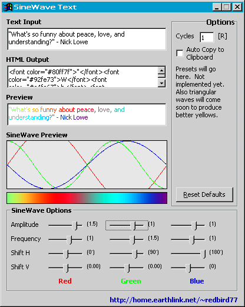

## SineWave Text v1\.00

### Description

SineWave Text is a program that produces HTML for colored text.

(To get true rainbow text, check out my other program Rainbow Text.

http://www.planet-source-code.com/vb/scripts/ShowCode.asp?txtCodeId=45032&lngWId=1)

This program works by drawing three sine waves (representing the red, blue, and green components of a color) with user-variable amplitude, frequency, and phase shifts. Then the program iterates through 360 degrees taking the value of each wave at each degree and merging them to form a color value.

Credit goes to this site http://www.mu.org/~doug/blend/index.html for introducing me to the idea of producing gradients from sine and other shaped waves.
 
### More Info
 

             |
---                |---
**Submitted On**   |2003-07-24 20:57:08
**By**             |[redbird77](https://github.com/Planet-Source-Code/PSCIndex/blob/master/ByAuthor/redbird77.md)
**Level**          |Intermediate
**User Rating**    |5.0 (10 globes from 2 users)
**Compatibility**  |VB 4\.0 \(32\-bit\), VB 5\.0, VB 6\.0
**Category**       |[Internet/ HTML](https://github.com/Planet-Source-Code/PSCIndex/blob/master/ByCategory/internet-html__1-34.md)
**World**          |[Visual Basic](https://github.com/Planet-Source-Code/PSCIndex/blob/master/ByWorld/visual-basic.md)
**Archive File**   |[SineWave\_T1619757242003\.zip](https://github.com/Planet-Source-Code/redbird77-sinewave-text-v1-00__1-47152/archive/master.zip)

